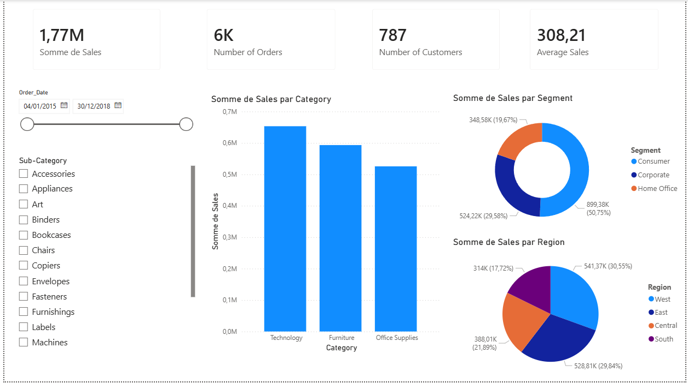
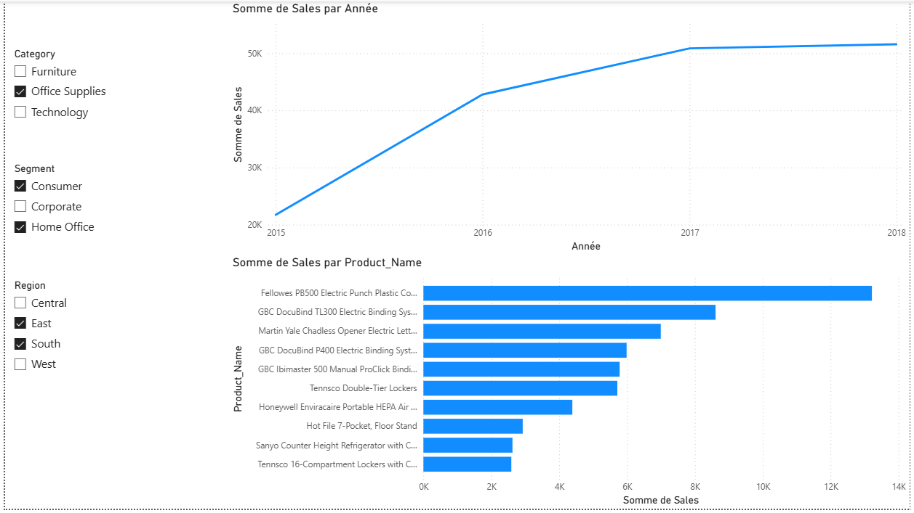
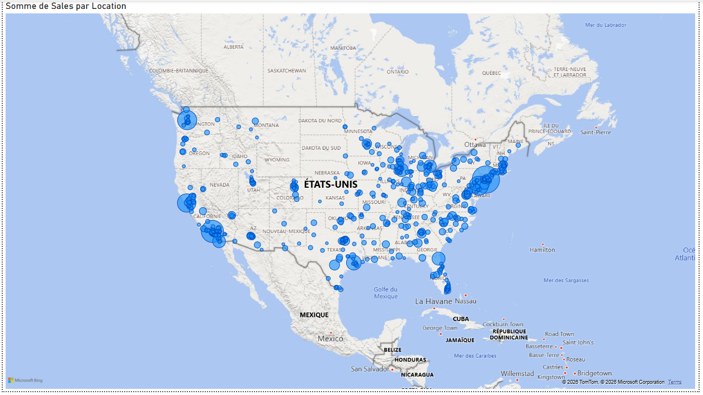

# 🛒 Superstore Sales Dashboard — Power BI

> Analyse des ventes d'un superstore américain (2015–2018) : nettoyage des données avec Python et visualisation interactive avec Power BI.

---

## 📌 Aperçu du projet

Ce projet couvre l'ensemble du pipeline d'un projet de data analytics, de la donnée brute jusqu'au dashboard interactif:

1. **Exploration & nettoyage** des données brutes avec Python (Pandas)
2. **Visualisation & analyse** avec Power BI Desktop

L'objectif est d'analyser les performances de ventes par catégorie de produit, région géographique et segment client sur 4 années (2015–2018).

---

## 🧹 Nettoyage des données (Python / Pandas)

Le notebook `Nettoyage.ipynb` effectue les étapes suivantes sur `raw_Superstore.csv` :

| Étape | Description |
|---|---|
| **Valeurs manquantes** | Suppression des lignes où `Postal Code` est absent |
| **Doublons** | Détection et suppression des lignes dupliquées |
| **Types de données** | Conversion de `Order Date` et `Ship Date` en `datetime`, `Postal Code` en `int` |
| **Renommage des colonnes** | Remplacement des espaces par des underscores (`Order Date` → `Order_Date`, etc.) |

**Résultat :** 9 789 lignes × 18 colonnes dans le fichier `cleaned_Superstore.csv`.

---

## 📊 Dashboard Power BI

Le fichier `Superstore_Dashboard.pbix` est construit sur le dataset nettoyé et permet d'explorer :

- **Ventes totales** par année, région et catégorie
- **Performance par segment** : Consumer, Corporate, Home Office
- **Top produits et sous-catégories** : Furniture, Office Supplies, Technology
- **Répartition géographique** : 4 régions US (South, West, Central, East)

---
## 📷 Aperçu du Dashboard

---

## 🛠️ Technologies utilisées

---

## 👤 Auteur

**Hiba Kourda**
[LinkedIn](https://www.linkedin.com/in/hibakourda/) · [GitHub](https://github.com/hibakourda2025)
